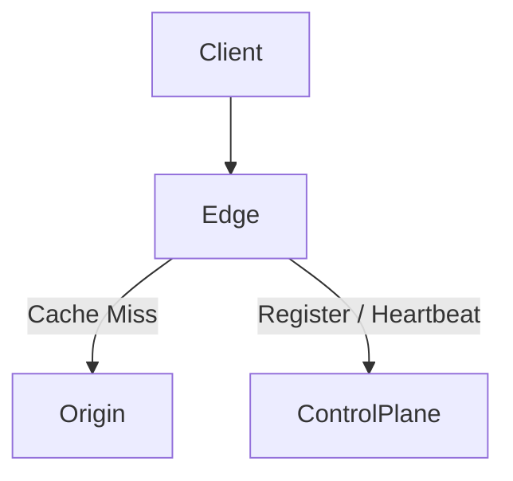

# CDN Platform (Control Plane + Edge + Origin)

A modular Content Delivery Network (CDN) platform built in Go, designed to demonstrate how real CDNs like Cloudflare / Fastly work internally.

This project focuses on **architecture, scalability, and systems design**, not just serving files.

Currently in active development.
---

## ✨ Features
- Central **Control Plane** for edge coordination
- Distributed **Edge Nodes** with heartbeat + caching
- **Origin Server** as source of truth
- Disk-based caching with cache hits/misses
- Dockerized services for local deployment

---

## 🧠 High-Level Architecture


---

### Components

| Component | Description |
|--------|------------|
| **Control Plane** | Manages configuration, routing rules, cache policies |
| **Edge Nodes** | Serve cached content, apply TTL, handle routing |
| **Origin Server** | Source of truth for content |
| **Metadata Store** | Stores cache rules, edge configs |

---

## ⚙️ Tech Stack

- **Language:** Go (Golang)
- **Networking:** net/http
- **Concurrency:** Goroutines & Channels
- **Storage:** Local FS / In-memory (pluggable)
- **Build Tool:** Go Modules

---

## 🛠 Prerequisites

- Go 1.20+
- Linux / macOS / WSL recommended

---

## 🚀 Quick Start

```bash
docker compose up --build
```

---

## 📚 Documentation

Full documentation and user guides are under development and will be available in the `/docs` directory.

---

## 🤝 Contributing

Contributions are welcome! Please read our [CONTRIBUTING.md](CONTRIBUTING.md) file for details on how to get started.

---

## 📄 License

This project is licensed under the MIT License - see the [LICENSE](LICENSE) file for details.

---

